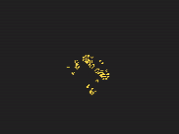

# gol-win32
Naive and simple Game of Life implementation with Win32 API.

It's not efficient, the rendering is done purely in software and poorly at that, it's just a learning excersise to be used for future learning and fun.

What more can I say, it does Game of Life!

